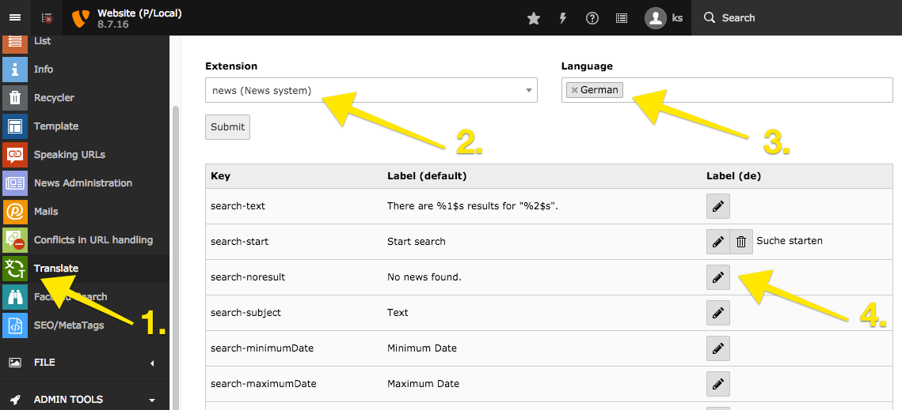
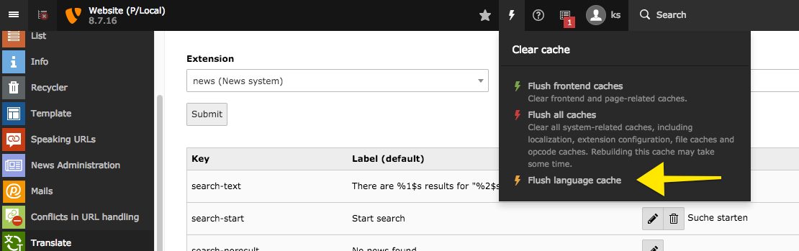

TYPO3 Extension ``translatr``
#############################

  .. image:: https://poser.pugx.org/sourcebroker/translatr/v/stable
    :target: https://packagist.org/packages/sourcebroker/translatr

  .. image:: https://poser.pugx.org/sourcebroker/translatr/license
    :target: https://packagist.org/packages/sourcebroker/translatr

.. contents:: :local:

What does it do?
****************

This extension allows to translate labels. The difference compared to other translation extension is that the labels are
stored in database. To avoid performance issues on first use of labels in frontend the xlf files are generated and
stored in typo3temp folder.

Installation
************

Use composer:

::

  composer require sourcebroker/translatr

Usage
*****

Workflow to add new labels:

After you edit new label clear the cache so the new labels will be generated:

Changelog
*********

See https://github.com/sourcebroker/translatr/blob/master/CHANGELOG.rst
